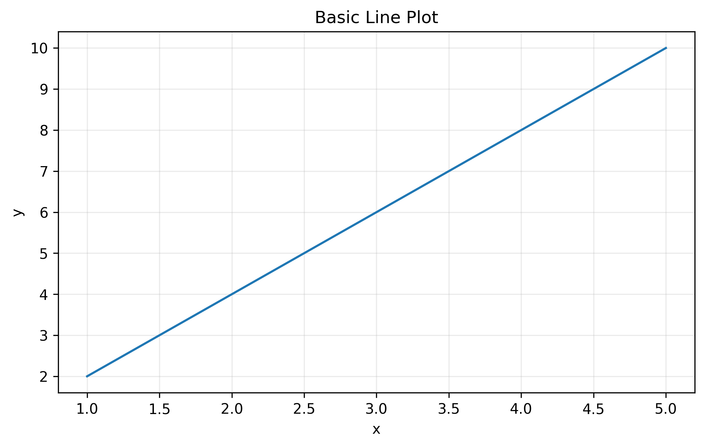
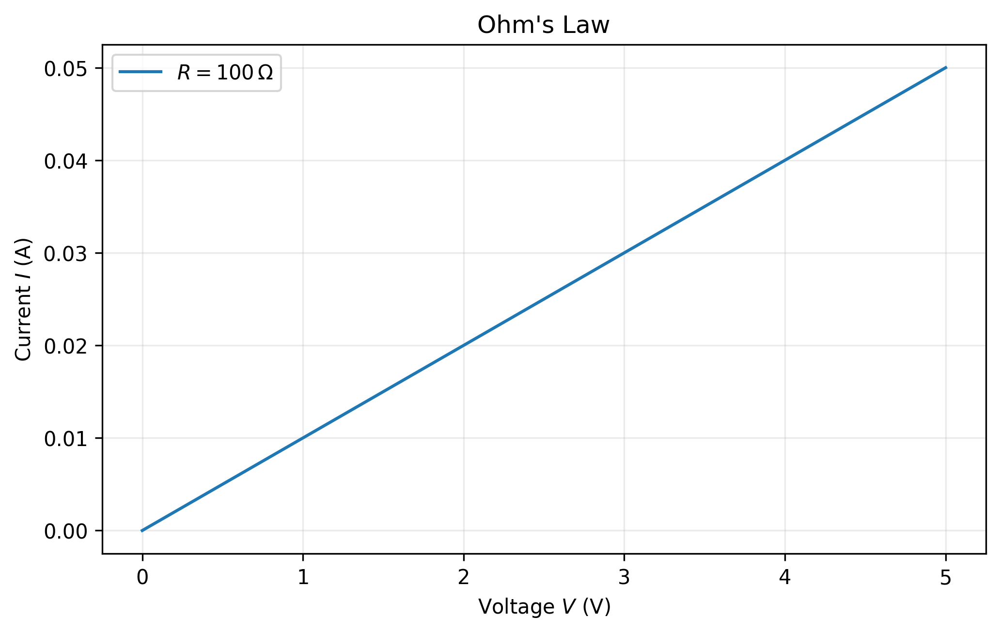
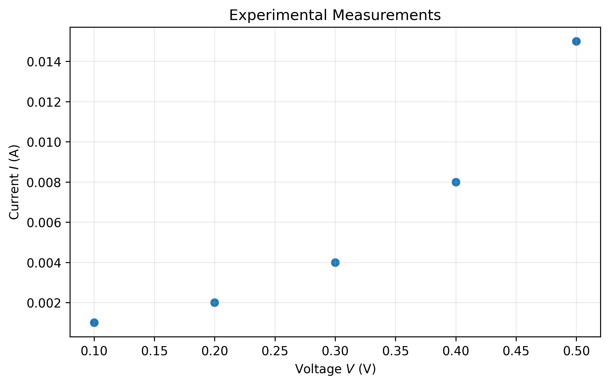
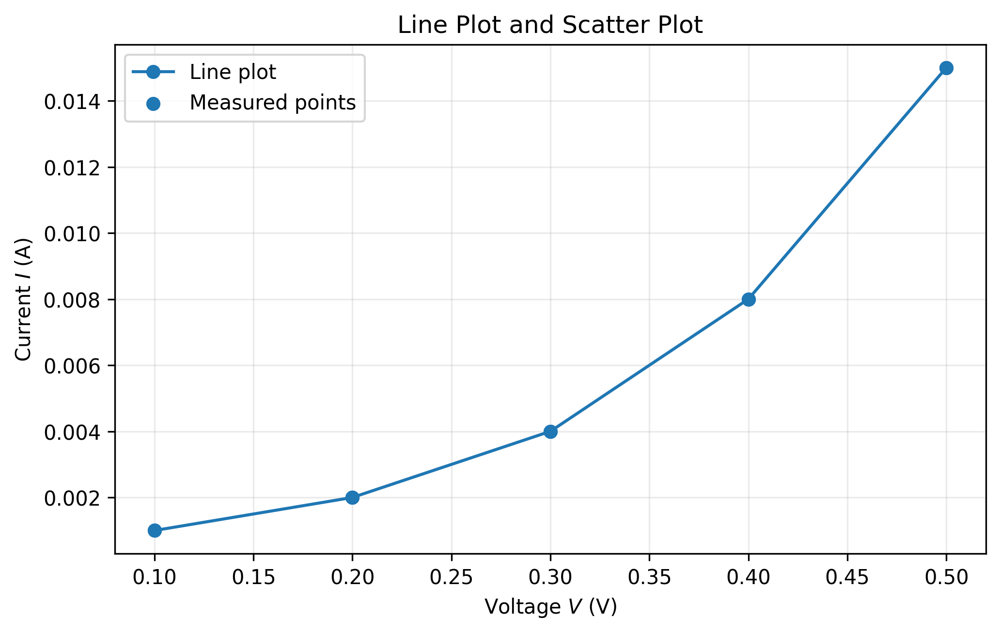
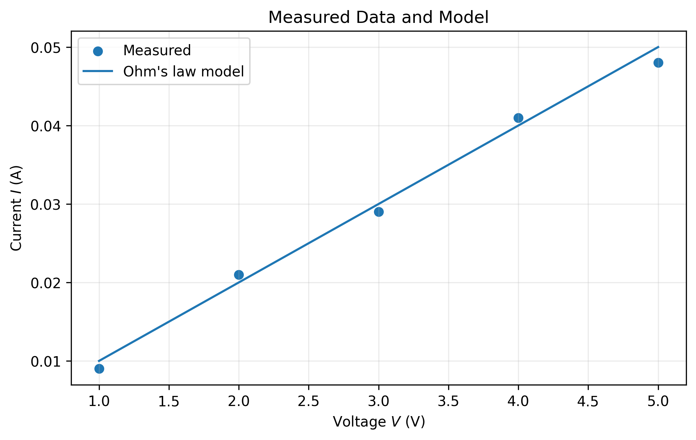
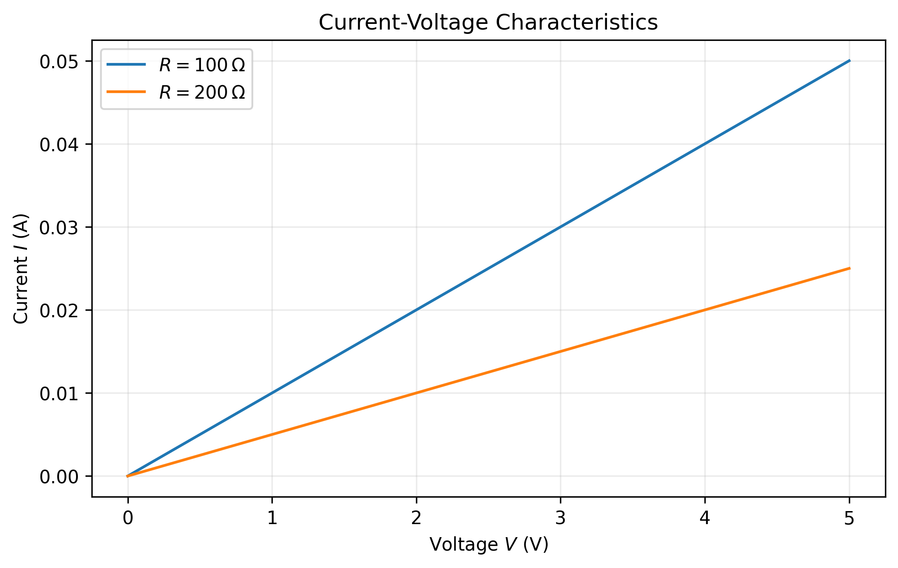
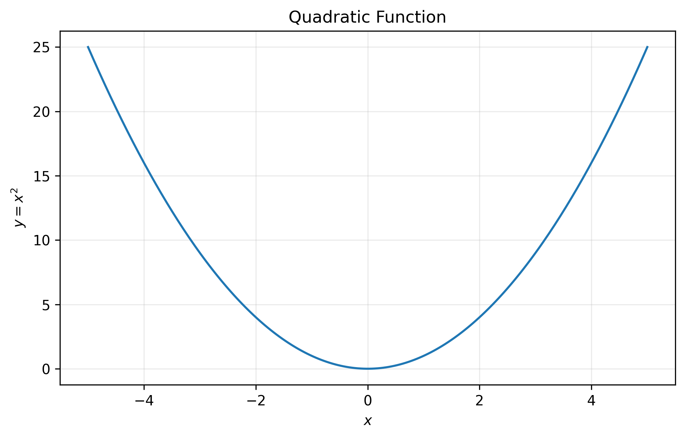
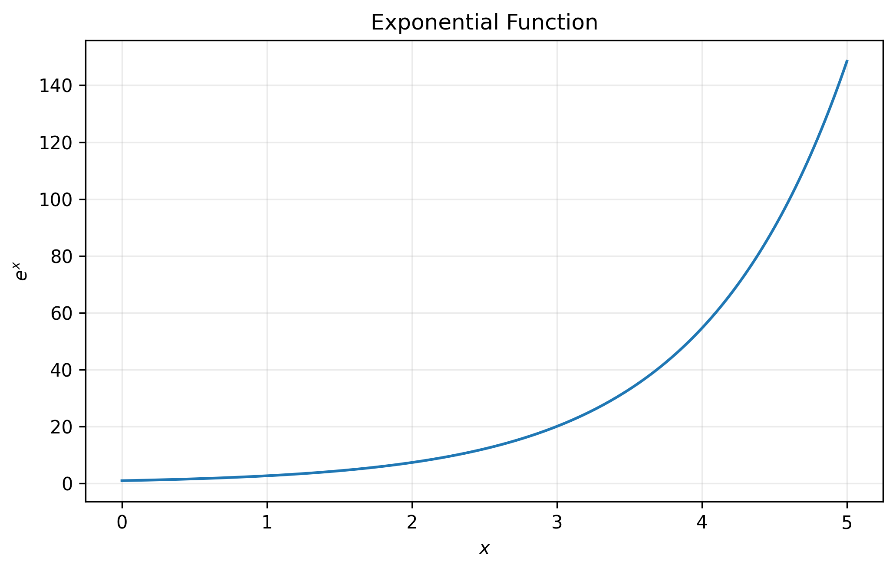
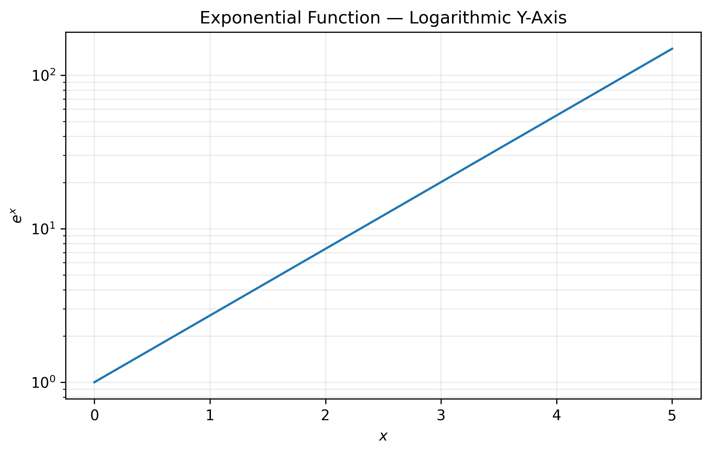
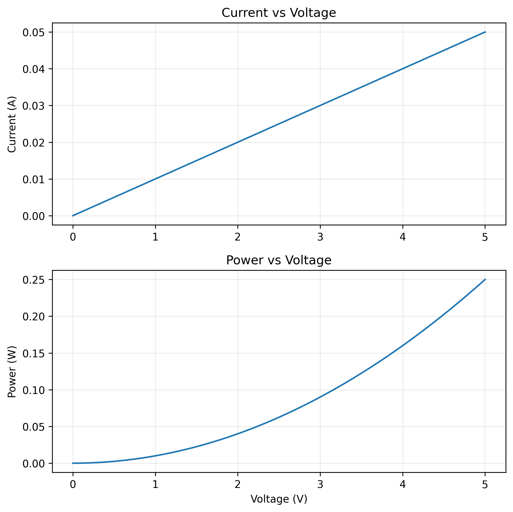

# Chapter 13 — Matplotlib Fundamentals

## 13.1 Learning Objectives

After completing this chapter, you should be able to:

- explain the role of Matplotlib in scientific Python;
- import Matplotlib using the standard `pyplot` interface;
- create basic line plots;
- create scatter plots;
- understand the difference between a figure and an axes;
- label x- and y-axes;
- add titles, legends, and grids;
- control basic figure dimensions;
- display multiple datasets;
- use Matplotlib with NumPy arrays;
- create clear scientific plots from numerical data;
- save scientific figures for reports and further use.

---

13.2 Why Visualization?

Numerical data is often difficult to understand when viewed only as a list of values.

Consider:

```python
V = [0, 1, 2, 3, 4, 5]
I = [0, 0.01, 0.02, 0.03, 0.04, 0.05]
```

The numbers tell us what was calculated.

A graph helps us see the relationship.

For this dataset:

$$
I=\frac{V}{100}.
$$

A plot makes the linear relationship immediately visible.

Scientific computing therefore often follows:

```text
Data
  ↓
Numerical calculation
  ↓
Visualization
  ↓
Interpretation
```

Matplotlib provides the visualization layer.

---

13.3 What Is Matplotlib?

**Matplotlib** is a Python library for creating graphs and scientific visualizations.

It is commonly used with NumPy.

The standard import is:

```python
import matplotlib.pyplot as plt
```

The name `plt` is a conventional abbreviation for `matplotlib.pyplot`.

After importing it, we can use commands such as:

```python
plt.plot()
plt.scatter()
plt.xlabel()
plt.ylabel()
plt.title()
plt.legend()
plt.grid()
plt.show()
```

---

13.4 The Basic Plotting Workflow

A simple Matplotlib workflow is:

```text
Import library
     ↓
Prepare data
     ↓
Create plot
     ↓
Add labels
     ↓
Add supporting information
     ↓
Display / save figure
```

In code:

```python
import matplotlib.pyplot as plt

plt.plot(x, y)

plt.xlabel("x")
plt.ylabel("y")
plt.title("A Simple Plot")

plt.grid()
plt.show()
```

The order can vary, but the basic structure remains similar.

---

13.5 Your First Line Plot

Consider:

```python
import numpy as np
import matplotlib.pyplot as plt

x = np.array([1, 2, 3, 4, 5])
y = np.array([2, 4, 6, 8, 10])

plt.plot(x, y)

plt.show()
```

The plotted points are:

$$
(1,2),\quad
(2,4),\quad
(3,6),\quad
(4,8),\quad
(5,10).
$$

The relationship is:

$$
y=2x.
$$

The line plot provides a visual representation of this relationship.

**Output — Figure 13.1**



The figure shows a straight-line relationship because \(y\) increases proportionally with \(x\).

---

13.6 Understanding `plt.plot()`

The basic form is:

```python
plt.plot(x, y)
```

where:

- `x` provides horizontal-axis values;
- `y` provides vertical-axis values.

For example:

```python
x = np.array([0, 1, 2, 3])
y = np.array([0, 2, 4, 6])

plt.plot(x, y)
plt.show()
```

Matplotlib uses corresponding values to form points:

```text
(0, 0)
(1, 2)
(2, 4)
(3, 6)
```

and connects them with line segments.

---

13.7 NumPy and Matplotlib Work Together

NumPy generates and calculates numerical data.

Matplotlib displays it.

For example:

```python
V = np.linspace(0, 5, 100)
R = 100

I = V / R
```

The arrays contain the numerical model.

Matplotlib can then display it:

```python
plt.plot(V, I)
plt.show()
```

The relationship is:

```text
NumPy
Generate / calculate
        ↓
Numerical arrays
        ↓
Matplotlib
Visualize
```

This combination is fundamental to scientific Python.

---

13.8 Adding Axis Labels

A scientific plot should identify its variables.

Use:

```python
plt.xlabel("Voltage (V)")
plt.ylabel("Current (A)")
```

Example:

```python
import numpy as np
import matplotlib.pyplot as plt

V = np.linspace(0, 5, 100)
I = V / 100

plt.plot(V, I)

plt.xlabel("Voltage (V)")
plt.ylabel("Current (A)")

plt.show()
```

The units are included in the labels.

This is important because a number without a unit may be scientifically ambiguous.

---

13.9 Adding a Title

A title describes the main purpose of the figure.

Use:

```python
plt.title("Ohm's Law")
```

Example:

```python
plt.plot(V, I)

plt.xlabel("Voltage (V)")
plt.ylabel("Current (A)")
plt.title("Ohm's Law")

plt.show()
```

A good title should be concise and informative.

---

13.10 Adding a Grid

A grid can help the reader estimate values from the graph.

Use:

```python
plt.grid()
```

Example:

```python
plt.plot(V, I)

plt.xlabel("Voltage (V)")
plt.ylabel("Current (A)")
plt.title("Ohm's Law")

plt.grid()

plt.show()
```

A grid is a readability aid.

It should not dominate the figure.

---

13.11 A Complete First Scientific Plot

The following example combines the basic elements:

```python
import numpy as np
import matplotlib.pyplot as plt

V = np.linspace(0, 5, 100)
R = 100

I = V / R

plt.plot(V, I)

plt.xlabel("Voltage (V)")
plt.ylabel("Current (A)")
plt.title("Ohm's Law")

plt.grid()

plt.show()
```

**Output — Figure 13.2**



The graph is a visual representation of:

$$
I=\frac{V}{R}.
$$

For constant \(R\), current varies linearly with voltage.

---

13.12 Line Plots and Experimental Data

A line plot is useful when the order and continuity of the x-values are meaningful.

For example:

```python
V = np.array([0, 1, 2, 3, 4, 5])
I = np.array([0, 0.01, 0.02, 0.03, 0.04, 0.05])
```

A line plot:

```python
plt.plot(V, I)
```

communicates the progression of current with voltage.

However, if these values are individual experimental observations, a scatter plot may communicate the measurements more appropriately.

---

13.13 Scatter Plots

A scatter plot displays observations as individual points.

The basic command is:

```python
plt.scatter(x, y)
```

Example:

```python
import numpy as np
import matplotlib.pyplot as plt

V = np.array([0.1, 0.2, 0.3, 0.4, 0.5])
I = np.array([0.001, 0.002, 0.004, 0.008, 0.015])

plt.scatter(V, I)

plt.xlabel("Voltage (V)")
plt.ylabel("Current (A)")
plt.title("Experimental Measurements")

plt.grid()

plt.show()
```

**Output — Figure 13.3**



Each point represents one observation.

---

13.14 Line Plot versus Scatter Plot

The choice depends on the meaning of the data.

### Line plot

```python
plt.plot(x, y)
```

Useful when:

- showing a continuous relationship;
- showing a calculated model;
- showing an ordered progression.

### Scatter plot

```python
plt.scatter(x, y)
```

Useful when:

- displaying experimental observations;
- examining the relationship between two variables;
- avoiding an implication that observations themselves form a continuous curve.

A common scientific pattern is:

```text
Experimental measurements → scatter
Mathematical model         → line
```

This is not an absolute rule, but it is a useful starting point.

---

13.15 Comparing Line and Scatter Representations

Using the same measurements, we can compare the two approaches.

```python
V = np.array([0.1, 0.2, 0.3, 0.4, 0.5])
I = np.array([0.001, 0.002, 0.004, 0.008, 0.015])

plt.plot(V, I, marker="o", label="Line plot")
plt.scatter(V, I, label="Measured points")

plt.xlabel("Voltage (V)")
plt.ylabel("Current (A)")
plt.title("Line Plot and Scatter Plot")

plt.grid()
plt.legend()

plt.show()
```

**Output — Figure 13.4**



The same observations can look different depending on how they are represented.

The important question is not simply:

> Which graph looks better?

The better question is:

> What does the graph imply about the data?

---

13.16 Plotting Experimental Data and a Model

Suppose measured data is:

```python
V_measured = np.array([
    1, 2, 3, 4, 5
])

I_measured = np.array([
    0.009, 0.021, 0.029, 0.041, 0.048
])
```

The theoretical model is:

$$
I=\frac{V}{100}.
$$

Generate a smooth model:

```python
V_model = np.linspace(1, 5, 100)
I_model = V_model / 100
```

Plot both:

```python
plt.scatter(
    V_measured,
    I_measured,
    label="Measured"
)

plt.plot(
    V_model,
    I_model,
    label="Model"
)

plt.xlabel("Voltage (V)")
plt.ylabel("Current (A)")
plt.title("Measured Data and Model")

plt.grid()
plt.legend()

plt.show()
```

**Output — Figure 13.5**



This is one of the most useful patterns in scientific visualization:

```text
Experimental observations
          +
Theoretical / calculated model
          ↓
       Comparison
```

The visual difference between the measured points and model line can motivate further analysis.

---

13.17 Legends

When multiple datasets appear in a figure, the reader needs to know which dataset is which.

Use the `label` argument:

```python
plt.plot(V_model, I_model, label="Model")
```

and then:

```python
plt.legend()
```

For example:

```python
plt.scatter(V_measured, I_measured, label="Measured")
plt.plot(V_model, I_model, label="Model")

plt.legend()
```

The legend connects visual elements to their meaning.

---

13.18 Figure and Axes

Matplotlib uses two important concepts:

### Figure

The complete drawing area or canvas.

### Axes

The plotting region where data is represented.

A useful mental model is:

```text
Figure
┌──────────────────────────────┐
│                              │
│        Axes                  │
│    ┌──────────────────┐      │
│    │                  │      │
│    │      Plot        │      │
│    │                  │      │
│    └──────────────────┘      │
│                              │
└──────────────────────────────┘
```

This distinction becomes important when creating multiple plots and controlling figure layout.

---

13.19 Creating a Figure

We can explicitly create a figure:

```python
plt.figure()
```

For example:

```python
plt.figure()

plt.plot(V, I)

plt.xlabel("Voltage (V)")
plt.ylabel("Current (A)")
plt.title("Ohm's Law")

plt.grid()
plt.show()
```

For simple plots, Matplotlib can create the figure automatically.

Explicitly creating one becomes useful when controlling its size or working with multiple figures.

---

13.20 Figure Size

Use:

```python
plt.figure(figsize=(8, 5))
```

The values represent:

```text
width, height
```

in inches.

Example:

```python
plt.figure(figsize=(8, 5))

plt.plot(V, I)

plt.xlabel("Voltage (V)")
plt.ylabel("Current (A)")
plt.title("Ohm's Law")

plt.grid()
plt.show()
```

Figure size matters when a plot will be placed in a report, book, or presentation.

---

13.21 Mathematical Notation in Labels

Scientific figures often require mathematical symbols.

Matplotlib supports mathematical notation using strings such as:

```python
r"$V$"
```

For example:

```python
plt.xlabel(r"Voltage $V$ (V)")
plt.ylabel(r"Current $I$ (A)")
```

The `$...$` notation identifies mathematical content.

The `r` creates a raw Python string.

---

13.22 Fractions in Labels

Mathematical expressions can also be written.

For example:

```python
plt.ylabel(r"$I=\frac{V}{R}$")
```

The displayed label represents:

$$
I=\frac{V}{R}.
$$

This is useful when the relationship itself is important to the figure.

---

13.23 Greek Symbols

Scientific plots frequently use Greek letters.

Examples:

```python
plt.xlabel(r"Temperature $\alpha$")
```

or:

```python
plt.ylabel(r"Mobility $\mu$")
```

Common symbols include:

```text
$\alpha$
$\beta$
$\mu$
$\sigma$
$\lambda$
```

Mathematical notation helps maintain consistency between equations and figures.

---

13.24 Multiple Data Series

Suppose two resistors are being compared.

```python
V = np.linspace(0, 5, 100)

R1 = 100
R2 = 200

I1 = V / R1
I2 = V / R2
```

Plot both:

```python
plt.plot(V, I1, label=r"$R=100\,\Omega$")
plt.plot(V, I2, label=r"$R=200\,\Omega$")

plt.xlabel(r"Voltage $V$ (V)")
plt.ylabel(r"Current $I$ (A)")
plt.title("Current-Voltage Characteristics")

plt.grid()
plt.legend()

plt.show()
```

**Output — Figure 13.6**



The graph allows direct comparison of the two relationships.

For a fixed voltage, the smaller resistance produces the larger current.

---

13.25 Plotting a Mathematical Function

Matplotlib can visualize mathematical functions generated using NumPy.

Consider:

$$
y=x^2.
$$

Python:

```python
x = np.linspace(-5, 5, 200)
y = x ** 2

plt.plot(x, y)

plt.xlabel(r"$x$")
plt.ylabel(r"$y=x^2$")
plt.title("Quadratic Function")

plt.grid()

plt.show()
```

**Output — Figure 13.7**



The function is first sampled numerically.

Matplotlib then visualizes those numerical samples.

---

13.26 Plotting an Exponential Function

Consider:

$$
y=e^x.
$$

Python:

```python
x = np.linspace(0, 5, 200)
y = np.exp(x)

plt.plot(x, y)

plt.xlabel(r"$x$")
plt.ylabel(r"$e^x$")
plt.title("Exponential Function")

plt.grid()

plt.show()
```

**Output — Figure 13.8**



The graph shows the rapid growth of the exponential function.

This type of behavior appears in several scientific and semiconductor models.

---

13.27 Logarithmic Axes

Scientific data may span several orders of magnitude.

For example:

$$
10^{-12},\quad10^{-9},\quad10^{-6},\quad10^{-3}.
$$

A linear scale may compress the smaller values.

Matplotlib provides:

```python
plt.semilogy(x, y)
```

for a logarithmic y-axis.

Example:

```python
x = np.linspace(0, 5, 100)
y = np.exp(x)

plt.semilogy(x, y)

plt.xlabel("x")
plt.ylabel("y")
plt.title("Logarithmic Y-Axis")

plt.grid()

plt.show()
```

**Output — Figure 13.9**



A logarithmic scale changes how numerical distances are represented.

It can make multiplicative or order-of-magnitude behavior easier to inspect.

---

13.28 Other Logarithmic Plot Types

Matplotlib also provides:

```python
plt.semilogx(x, y)
```

for a logarithmic x-axis.

And:

```python
plt.loglog(x, y)
```

for logarithmic x and y axes.

These are useful when scientific variables span large numerical ranges.

---

13.29 Multiple Figures

Sometimes separate figures are required.

For example:

```python
plt.figure()

plt.plot(V, I)
plt.title("Current")

plt.figure()

plt.plot(V, P)
plt.title("Power")

plt.show()
```

Each call to:

```python
plt.figure()
```

creates a separate figure.

Separate figures can be useful when the plots represent different scientific questions.

---

13.30 Basic Subplots

When related plots need to appear together, subplots can be used.

For example:

```python
fig, ax = plt.subplots(2, 1)
```

creates two axes arranged vertically.

Example:

```python
fig, ax = plt.subplots(2, 1)

ax[0].plot(V, I)
ax[0].set_ylabel("Current (A)")
ax[0].set_title("Current")

ax[1].plot(V, P)
ax[1].set_xlabel("Voltage (V)")
ax[1].set_ylabel("Power (W)")
ax[1].set_title("Power")

plt.tight_layout()
plt.show()
```

**Output — Figure 13.10**



The `ax` objects represent the individual plotting areas.

More detailed subplot design will be developed in the next chapter.

---

13.31 Saving a Figure

A scientific figure often needs to be saved.

Use:

```python
plt.savefig("figure.png")
```

For example:

```python
plt.plot(V, I)

plt.xlabel("Voltage (V)")
plt.ylabel("Current (A)")
plt.title("Ohm's Law")

plt.grid()

plt.savefig("ohms_law.png", dpi=300)

plt.show()
```

The saved image can be used in a report, presentation, or book.

---

13.32 PNG and PDF Output

PNG is a common raster image format:

```python
plt.savefig("figure.png", dpi=300)
```

PDF can provide scalable output:

```python
plt.savefig("figure.pdf")
```

For scientific documents, vector output such as PDF can be particularly useful when appropriate.

The choice depends on how the figure will be used.

---

13.33 `tight_layout()`

Labels and titles can sometimes overlap.

Use:

```python
plt.tight_layout()
```

Example:

```python
plt.plot(V, I)

plt.xlabel("Voltage (V)")
plt.ylabel("Current (A)")
plt.title("Ohm's Law")

plt.tight_layout()
plt.show()
```

It is especially useful when working with multiple axes.

---

13.34 A Scientific Plot Checklist

Before including a plot in a scientific report, check:

### Data

- Are the correct arrays being plotted?
- Are observations paired correctly?

### Axes

- Is the x-axis labelled?
- Is the y-axis labelled?
- Are units included?

### Title

- Does the title describe the figure?

### Legend

- Is a legend required?
- Does each dataset have a clear label?

### Scale

- Is a linear scale appropriate?
- Would a logarithmic scale be more informative?

### Presentation

- Are labels readable?
- Is the figure large enough?
- Are unnecessary elements avoided?

### Scientific meaning

- Does the graph support the intended interpretation?

---

13.35 Worked Example — Complete Ohm's Law Plot

The following example demonstrates the complete workflow.

```python
import numpy as np
import matplotlib.pyplot as plt

V = np.linspace(0, 5, 100)

R = 100

I = V / R

plt.figure(figsize=(7, 5))

plt.plot(
    V,
    I,
    label=r"$R=100\,\Omega$"
)

plt.xlabel(r"Voltage $V$ (V)")
plt.ylabel(r"Current $I$ (A)")
plt.title("Ohm's Law")

plt.grid()
plt.legend()
plt.tight_layout()

plt.show()
```

The output is the same physical relationship shown in Figure 13.2.

### Interpretation

The graph represents:

$$
I=\frac{V}{R}.
$$

Since \(R\) is constant, current increases linearly with voltage.

The slope is:

$$
\frac{\Delta I}{\Delta V}
=
\frac{1}{R}.
$$

For:

$$
R=100\,\Omega,
$$

the slope is:

$$
0.01\,\mathrm{A/V}.
$$

The graph therefore provides a visual representation of the physical relationship.

---

13.36 Worked Example — Experimental Data

Consider measured data:

```python
V = np.array([
    0.1,
    0.2,
    0.3,
    0.4,
    0.5
])

I = np.array([
    0.001,
    0.002,
    0.004,
    0.008,
    0.015
])
```

Create a scatter plot:

```python
plt.figure(figsize=(7, 5))

plt.scatter(V, I)

plt.xlabel(r"Voltage $V$ (V)")
plt.ylabel(r"Current $I$ (A)")
plt.title("Measured Device Data")

plt.grid()
plt.tight_layout()

plt.show()
```

The output corresponds to Figure 13.3.

Each point represents one experimental observation.

The shape suggests that current does not increase linearly over the measured range.

A physical model may later be fitted to these observations.

---

13.37 Worked Example — Measured Data and Model

Measured data:

```python
V_measured = np.array([
    1, 2, 3, 4, 5
])

I_measured = np.array([
    0.009,
    0.021,
    0.029,
    0.041,
    0.048
])
```

Model:

$$
I=\frac{V}{100}.
$$

Generate model values:

```python
V_model = np.linspace(1, 5, 100)
I_model = V_model / 100
```

Plot:

```python
plt.figure(figsize=(7, 5))

plt.scatter(
    V_measured,
    I_measured,
    label="Measured"
)

plt.plot(
    V_model,
    I_model,
    label="Ohm's law model"
)

plt.xlabel(r"Voltage $V$ (V)")
plt.ylabel(r"Current $I$ (A)")
plt.title("Measured Data and Model")

plt.grid()
plt.legend()
plt.tight_layout()

plt.show()
```

The output corresponds to Figure 13.5.

The plot allows the student to compare observations with a theoretical relationship.

This pattern will be used extensively in later chapters.

---

13.38 Common Beginner Mistakes

### Mistake 1 — Plotting without labels

Avoid:

```python
plt.plot(x, y)
```

as a final scientific figure.

Add meaningful labels.

### Mistake 2 — Forgetting units

Prefer:

```python
plt.xlabel("Voltage (V)")
```

over:

```python
plt.xlabel("Voltage")
```

### Mistake 3 — Using the wrong plot type

A scatter plot may be more appropriate for individual experimental observations.

### Mistake 4 — Missing a legend

When multiple datasets are present, the reader should be able to identify them.

### Mistake 5 — Using an inappropriate axis scale

A logarithmic scale may be necessary for data spanning several orders of magnitude.

### Mistake 6 — Overloading one figure

Too many datasets can make a graph difficult to interpret.

### Mistake 7 — Plotting unvalidated data

A graph can make incorrect data look convincing.

Always inspect the data before visualization.

### Mistake 8 — Treating visualization as interpretation

A graph reveals patterns.

The scientist must determine what those patterns mean.

---

13.39 Exercises

### Exercise 1 — First Plot

Create:

```python
x = np.array([1, 2, 3, 4, 5])
y = np.array([2, 4, 6, 8, 10])
```

Create a scientific line plot with:

- x-axis label;
- y-axis label;
- title;
- grid.

---

### Exercise 2 — Ohm's Law

Generate:

$$
0\leq V\leq5\,\mathrm{V}
$$

using:

```python
np.linspace()
```

For:

$$
R=100\,\Omega,
$$

calculate current and create an I-V plot.

---

### Exercise 3 — Scatter Plot

Use:

```text
V = 0.1, 0.2, 0.3, 0.4, 0.5 V
I = 0.001, 0.002, 0.004, 0.008, 0.015 A
```

Create a scatter plot.

---

### Exercise 4 — Two Resistors

Plot the I-V characteristics of:

$$
R_1=100\,\Omega
$$

and:

$$
R_2=200\,\Omega.
$$

Add a legend.

---

### Exercise 5 — Mathematical Function

Plot:

$$
y=x^2
$$

for:

$$
-5\leq x\leq5.
$$

Use at least 100 numerical points.

---

### Exercise 6 — Exponential Function

Plot:

$$
y=e^x
$$

for:

$$
0\leq x\leq5.
$$

Create both a linear-y plot and a logarithmic-y plot.

Compare them.

---

### Exercise 7 — Measured Data and Model

Create a scatter plot for experimental data and a line plot for a simple theoretical model.

Use different labels for the two datasets.

---

### Exercise 8 — Save a Figure

Create an I-V plot and save it as:

```text
iv_curve.png
```

using:

```python
dpi=300
```

Open the saved image and inspect its quality.

---

13.40 Think and Apply

A student creates the following graph:

```python
plt.plot(V, I)
plt.show()
```

The graph is technically correct.

However, would it be suitable for a scientific report?

What information is missing?

Think about:

- variable names;
- units;
- title;
- data meaning;
- legend;
- scale;
- readability.

A scientifically useful graph must communicate more than the existence of a curve.

---

13.41 Chapter Summary

In this chapter, we learned that:

1. Matplotlib provides the visualization layer of the scientific Python workflow.
2. `matplotlib.pyplot` provides a convenient plotting interface.
3. `plt.plot()` creates line plots.
4. `plt.scatter()` creates scatter plots.
5. `xlabel()` and `ylabel()` identify variables.
6. Units should normally be included in scientific axis labels.
7. `title()` provides a concise description of the figure.
8. `legend()` identifies multiple datasets.
9. `grid()` can improve readability.
10. NumPy arrays can be passed directly to Matplotlib.
11. Experimental observations and theoretical models can be displayed together.
12. Mathematical notation can be included in labels.
13. Linear and logarithmic scales serve different scientific purposes.
14. Figures can be controlled using `figsize`.
15. `savefig()` allows figures to be stored for reports and other documents.
16. `tight_layout()` can improve figure layout.
17. A scientific graph should be checked for correctness, clarity, and interpretation.

---

13.42 Key Takeaway

> **Matplotlib turns numerical arrays into visual scientific information. A good scientific plot is not simply a curve on a screen; it clearly communicates the variables, units, relationships, observations, and scientific question being examined.**

The next chapter builds on these fundamentals with **scientific visualization techniques**, including multiple datasets, subplots, figure design, mathematical models, logarithmic representations, and publication-ready figures.
