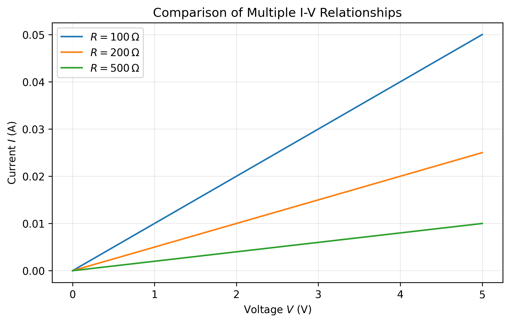
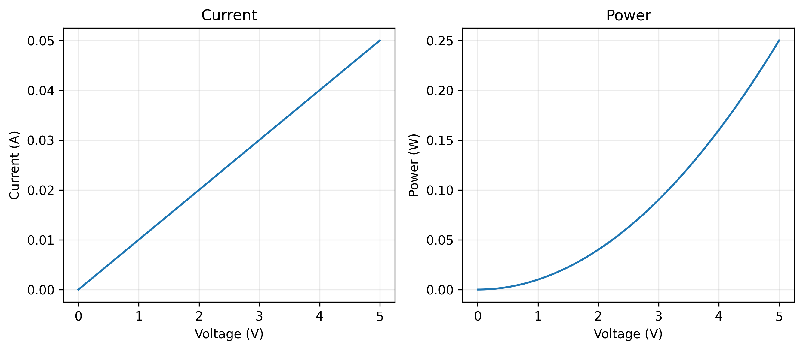
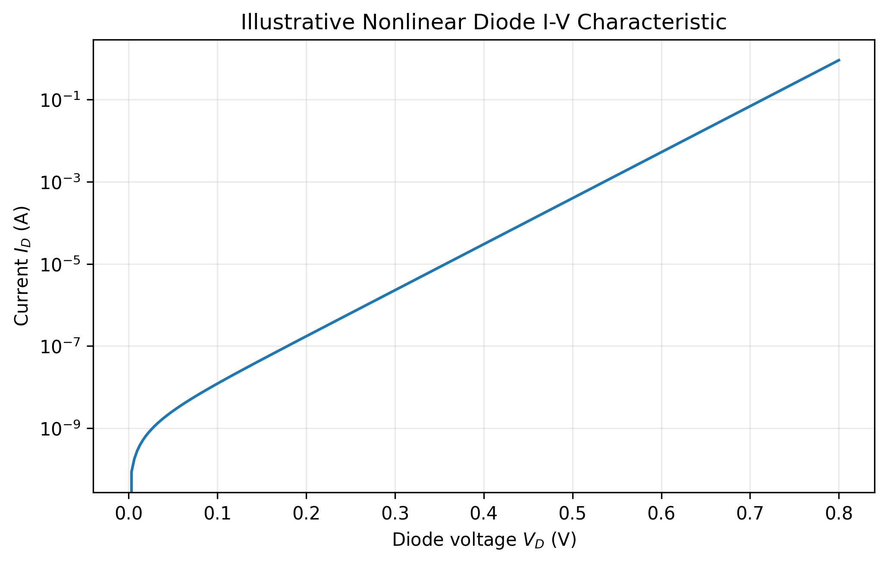
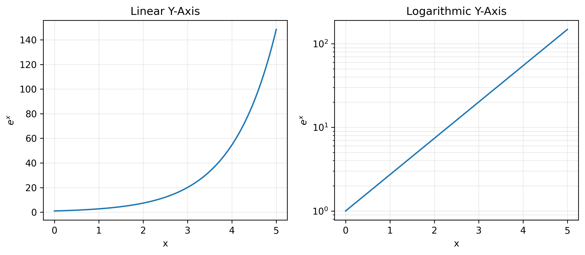
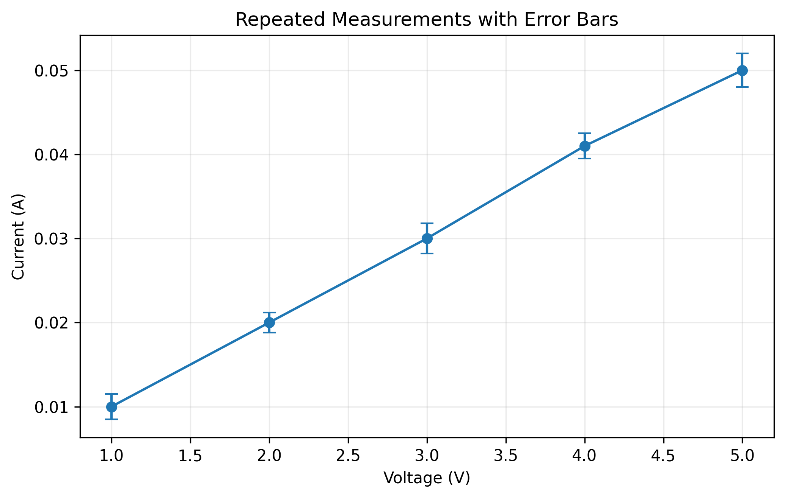
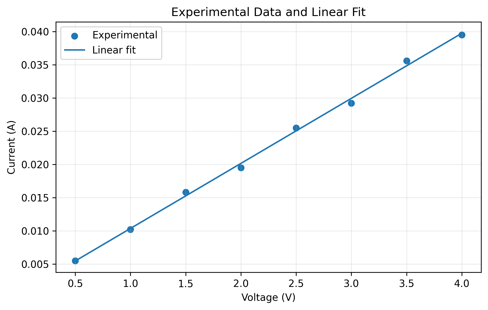
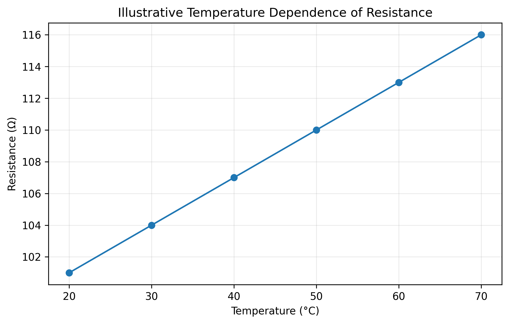
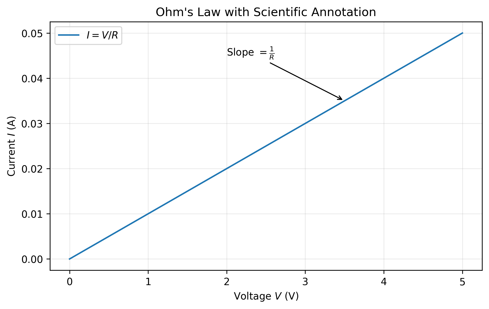

# Chapter 14 — Scientific Visualization with Matplotlib

## 14.1 Learning Objectives

After completing this chapter, you should be able to:

- plot and compare multiple scientific datasets;
- use subplots to organize related measurements;
- distinguish between linear and logarithmic representations;
- visualize nonlinear scientific relationships;
- display repeated measurements and uncertainty using error bars;
- compare experimental observations with fitted models;
- annotate scientific figures;
- select appropriate scales, labels, and units;
- prepare clear figures for scientific reports.

---

14.2 From Basic Plots to Scientific Visualization

Chapter 13 introduced the basic Matplotlib workflow.

A scientific figure usually needs to communicate more than a single numerical relationship.

```text
Scientific data
      ↓
Numerical preparation
      ↓
Appropriate plot type
      ↓
Labels + units + scale
      ↓
Comparison / uncertainty / model
      ↓
Interpretation
      ↓
Scientific figure
```

The goal is not to decorate a graph. The goal is to make scientific information easier to understand.

---

14.3 Plotting Multiple Datasets

Suppose:

$$
I=\frac{V}{R}.
$$

```python
import numpy as np
import matplotlib.pyplot as plt

V = np.linspace(0, 5, 200)

I_100 = V / 100
I_200 = V / 200
I_500 = V / 500

plt.plot(V, I_100, label=r"$R=100\,\Omega$")
plt.plot(V, I_200, label=r"$R=200\,\Omega$")
plt.plot(V, I_500, label=r"$R=500\,\Omega$")

plt.xlabel(r"Voltage $V$ (V)")
plt.ylabel(r"Current $I$ (A)")
plt.title("Comparison of Multiple I-V Relationships")
plt.grid()
plt.legend()
plt.show()
```

**Output — Figure 14.1**



At a fixed voltage, smaller resistance produces larger current. The slope is:

$$
\frac{\Delta I}{\Delta V}=\frac{1}{R}.
$$

---

14.4 Legends

When several datasets are plotted together, the reader must identify each one.

Use:

```python
plt.plot(V, I_100, label=r"$R=100\,\Omega$")
plt.legend()
```

Every visual dataset that needs interpretation should have an identifiable meaning.

---

14.5 Subplots

Current is:

$$
I=\frac{V}{R}
$$

and electrical power is:

$$
P=VI.
$$

```python
fig, ax = plt.subplots(1, 2, figsize=(9, 4))

ax[0].plot(V, I)
ax[0].set_xlabel("Voltage (V)")
ax[0].set_ylabel("Current (A)")
ax[0].set_title("Current")
ax[0].grid()

ax[1].plot(V, P)
ax[1].set_xlabel("Voltage (V)")
ax[1].set_ylabel("Power (W)")
ax[1].set_title("Power")
ax[1].grid()

plt.tight_layout()
plt.show()
```

**Output — Figure 14.2**



Subplots are useful when graphs answer related questions and need comparison.

---

14.6 Understanding `fig` and `ax`

In:

```python
fig, ax = plt.subplots(1, 2)
```

`fig` represents the complete figure.

`ax` contains the individual plotting areas.

For two subplots:

```python
ax[0]
ax[1]
```

refer to the first and second axes.

This object-oriented style becomes useful when figures contain several plots.

---

14.7 Nonlinear Semiconductor Characteristics

Many semiconductor relationships are nonlinear.

A simplified diode equation is:

$$
I_D =
I_0
\left[
\exp\left(\frac{V_D}{nV_T}\right)-1
\right].
$$

```python
Vd = np.linspace(0, 0.8, 250)

I0 = 1e-9
n = 1.5
Vt = 0.02585

Id = I0 * (np.exp(Vd / (n * Vt)) - 1)

plt.plot(Vd, Id)
plt.xlabel(r"Diode voltage $V_D$ (V)")
plt.ylabel(r"Current $I_D$ (A)")
plt.title("Illustrative Nonlinear Diode I-V Characteristic")
plt.yscale("log")
plt.grid()
plt.show()
```

**Output — Figure 14.3**



This is an **illustrative mathematical model**, not measured laboratory data.

---

14.8 Why Use a Logarithmic Scale?

Suppose a variable changes from:

$$10^{-12}$$

to:

$$10^{-3}.$$

A linear axis may make smaller values difficult to inspect.

Use:

```python
plt.yscale("log")
```

or:

```python
plt.semilogy(x, y)
```

A logarithmic scale should be selected because it is scientifically appropriate, not simply because the graph looks better.

---

14.9 Linear and Logarithmic Representations

Consider:

$$
y=e^x.
$$

```python
x = np.linspace(0, 5, 200)
y = np.exp(x)

fig, ax = plt.subplots(1, 2, figsize=(9, 4))

ax[0].plot(x, y)
ax[0].set_title("Linear Y-Axis")

ax[1].semilogy(x, y)
ax[1].set_title("Logarithmic Y-Axis")

plt.tight_layout()
plt.show()
```

**Output — Figure 14.4**



The data have not changed. Only the representation has changed.

---

14.10 Error Bars and Repeated Measurements

Scientific measurements often contain variation.

```python
V = np.array([1, 2, 3, 4, 5])

I_mean = np.array([0.010, 0.020, 0.030, 0.041, 0.050])

I_sd = np.array([0.0015, 0.0012, 0.0018, 0.0015, 0.0020])

plt.errorbar(
    V, I_mean,
    yerr=I_sd,
    fmt="o-",
    capsize=4
)

plt.xlabel("Voltage (V)")
plt.ylabel("Current (A)")
plt.title("Repeated Measurements with Error Bars")
plt.grid()
plt.show()
```

**Output — Figure 14.5**



The error bars communicate the variation represented by the supplied uncertainty values. Their exact scientific meaning must be defined by the experimental method.

---

14.11 Mean and Standard Deviation

For observations:

$$
x_1,x_2,\ldots,x_n,
$$

the sample mean is:

$$
\bar{x}
=
\frac{1}{n}
\sum_{i=1}^{n}x_i.
$$

The sample standard deviation is:

$$
s=
\sqrt{
\frac{1}{n-1}
\sum_{i=1}^{n}(x_i-\bar{x})^2
}.
$$

In Python:

```python
mean = np.mean(data)
std = np.std(data, ddof=1)
```

The statistical calculation and visualization are conceptually separate:

```text
Repeated observations
        ↓
Statistical summary
        ↓
Mean + uncertainty
        ↓
Visualization
```

---

14.12 Experimental Data and a Fitted Model

For a simple linear model:

$$
y=a+bx.
$$

Use:

```python
coef = np.polyfit(V, I, 1)
```

Then:

```python
V_fit = np.linspace(V.min(), V.max(), 100)
I_fit = np.polyval(coef, V_fit)
```

Plot:

```python
plt.scatter(V, I, label="Experimental")
plt.plot(V_fit, I_fit, label="Linear fit")

plt.xlabel("Voltage (V)")
plt.ylabel("Current (A)")
plt.title("Experimental Data and Linear Fit")
plt.grid()
plt.legend()
plt.show()
```

**Output — Figure 14.6**



A fitted line summarizes a trend. It does not by itself prove that the linear model is scientifically appropriate.

---

14.13 Temperature-Dependent Data

Scientific measurements often depend on temperature.

```python
T = np.array([20, 30, 40, 50, 60, 70])

R = np.array([101, 104, 107, 110, 113, 116])

plt.plot(T, R, marker="o")

plt.xlabel("Temperature (°C)")
plt.ylabel("Resistance (Ω)")
plt.title("Illustrative Temperature Dependence of Resistance")
plt.grid()
plt.show()
```

**Output — Figure 14.7**



This dataset is illustrative. Actual behavior depends on the material and device.

---

14.14 Annotations

Use:

```python
plt.annotate()
```

to identify an important feature.

Example:

```python
plt.annotate(
    r"Slope $=\frac{1}{R}$",
    xy=(3.5, 0.035),
    xytext=(2, 0.045),
    arrowprops=dict(arrowstyle="->")
)
```

**Output — Figure 14.8**



Annotations should help interpretation rather than decorate the figure.

---

14.15 Scientific Notation and Units

Prefer labels such as:

```python
plt.xlabel(r"Voltage $V$ (V)")
plt.ylabel(r"Current $I$ (A)")
```

For resistance:

```python
plt.ylabel(r"Resistance $R$ ($\Omega$)")
```

For temperature:

```python
plt.xlabel(r"Temperature $T$ ($^\circ$C)")
```

Clear notation reduces ambiguity.

---

14.16 Choosing a Plot Type

| Scientific purpose | Suitable plot |
|---|---|
| Continuous relationship | Line plot |
| Individual measurements | Scatter plot |
| Multiple related datasets | Multiple lines/scatters |
| Uncertainty | Error-bar plot |
| Distribution | Histogram |
| Category comparison | Bar plot |
| Large numerical range | Logarithmic axis |
| Related views | Subplots |

The plot type should follow the meaning of the data.

---

14.17 Scientific Visualization Is Not Decoration

A scientific figure should answer a question.

Examples:

**Does current increase linearly with voltage?**

Use an I-V plot.

**How does temperature affect resistance?**

Use a temperature-response plot.

**How closely does a model describe measurements?**

Plot observations and model together.

**How much variation exists among repeated measurements?**

Use error bars or another uncertainty representation.

Visualization is therefore part of scientific reasoning.

---

14.18 Figure Quality for Scientific Reports

A report-ready figure should normally have:

- readable dimensions;
- meaningful axis labels;
- units;
- an informative title or caption;
- appropriate scale;
- a clear legend when necessary;
- sufficient resolution;
- no unnecessary decoration.

For example:

```python
plt.figure(figsize=(7, 5))
plt.savefig("figure.png", dpi=300, bbox_inches="tight")
```

For scientific documents, vector formats such as PDF or SVG may also be appropriate.

---

14.19 Reusable Scientific Plot Template

```python
import numpy as np
import matplotlib.pyplot as plt

x = np.linspace(0, 5, 100)
y = x**2

plt.figure(figsize=(7, 5))

plt.plot(x, y, label=r"$y=x^2$")

plt.xlabel(r"$x$")
plt.ylabel(r"$y$")
plt.title("Scientific Plot")

plt.grid()
plt.legend()
plt.tight_layout()

plt.show()
```

Students can adapt this structure to many scientific applications.

---

14.20 Common Mistakes

### Mistake 1 — Too many datasets

Adding every available dataset to one figure can make interpretation difficult.

### Mistake 2 — Inappropriate scale

A logarithmic axis should have a scientific justification.

### Mistake 3 — Missing units

A numerical axis without units may be ambiguous.

### Mistake 4 — Misleading line connections

Connecting unrelated observations can imply continuity that does not exist.

### Mistake 5 — Excessive decoration

Scientific figures should prioritize information.

### Mistake 6 — Unexplained error bars

The reader should know what the error bars represent.

### Mistake 7 — Treating a fitted curve as experimental data

Measured observations and fitted models should be clearly distinguished.

### Mistake 8 — Poor resolution

Figures used in reports should have sufficient resolution for their intended output.

---

14.21 Exercises

1. Plot I-V curves for \(R=100\,\Omega\), \(200\,\Omega\), and \(500\,\Omega\).
2. Create two subplots showing current and power.
3. Generate \(y=e^x\) and compare linear and logarithmic-y representations.
4. Create repeated measurements and display standard deviation with error bars.
5. Generate observations around a linear relationship and fit a line using `np.polyfit()`.
6. Create an I-V plot and annotate its slope.
7. Save one figure as PNG at `dpi=300` and another as PDF.

---

14.22 Think and Apply

A student plots semiconductor data that spans several orders of magnitude and uses a logarithmic y-axis.

Is that automatically better?

No.

Ask:

1. What scientific question is being examined?
2. What range does the data cover?
3. Is a logarithmic representation meaningful?
4. Can the reader understand the axis?
5. Are the units and labels correct?
6. Is the transformation explained?

A good scientific figure requires both technical correctness and scientific reasoning.

---

14.23 Chapter Summary

In this chapter, we learned that:

1. Multiple datasets can be plotted together for comparison.
2. Legends identify different datasets.
3. Subplots organize related scientific views.
4. `fig` and `ax` provide greater control over complex figures.
5. Semiconductor characteristics can be nonlinear.
6. Logarithmic axes can represent large numerical ranges.
7. Changing the axis scale does not change the underlying data.
8. Error bars can represent measurement uncertainty when their meaning is defined.
9. `np.polyfit()` can provide a simple linear model.
10. Experimental observations and fitted models should be distinguished.
11. Temperature-dependent measurements can be visualized.
12. Annotations can highlight important scientific relationships.
13. Scientific figures should use clear labels, units, scales, and legends.
14. Visualization should support scientific reasoning rather than decoration.
15. High-resolution and vector output can be useful for scientific reports.

---

14.24 Key Takeaway

> **Scientific visualization is the process of choosing and constructing graphical representations that help us understand data, compare measurements with models, communicate uncertainty, and support scientific reasoning.**
