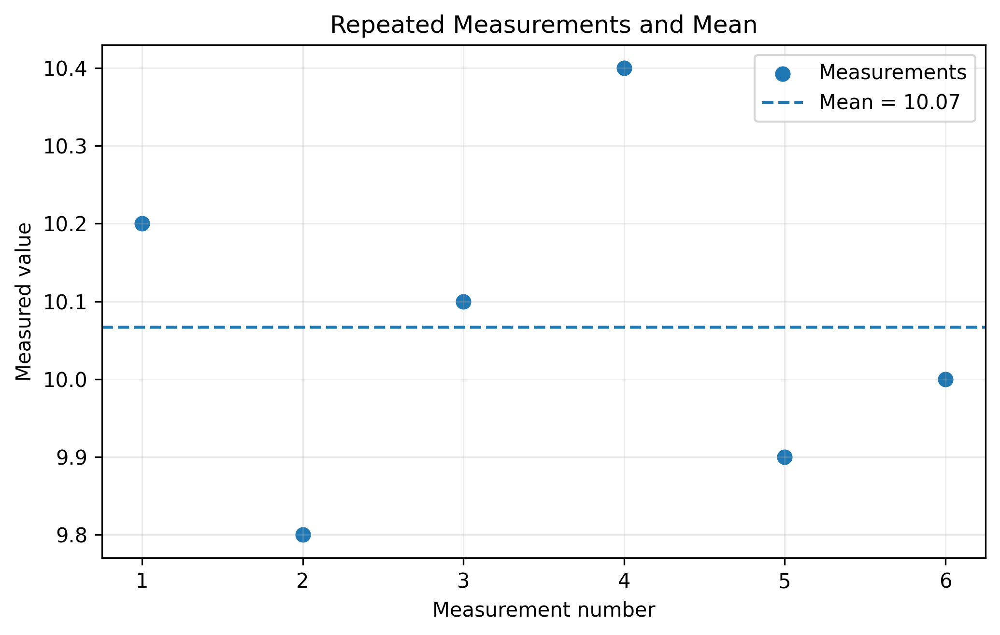
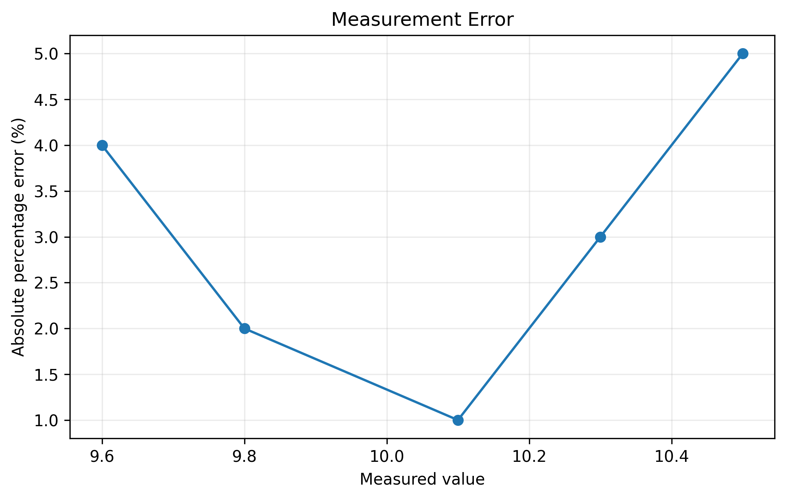
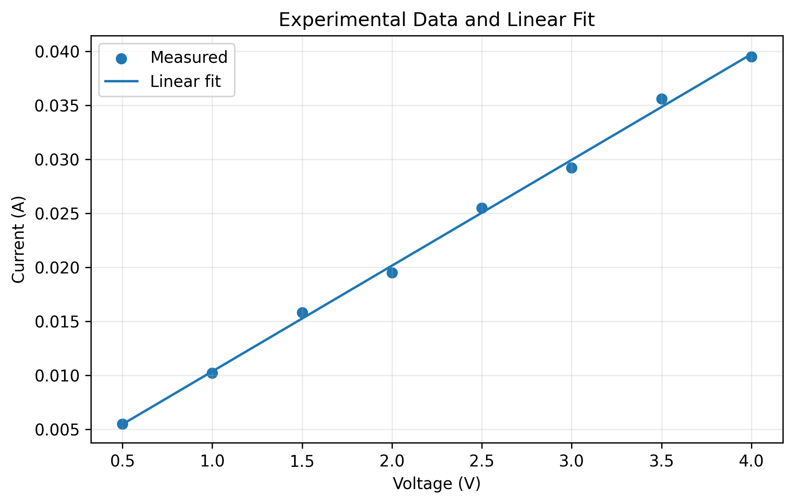
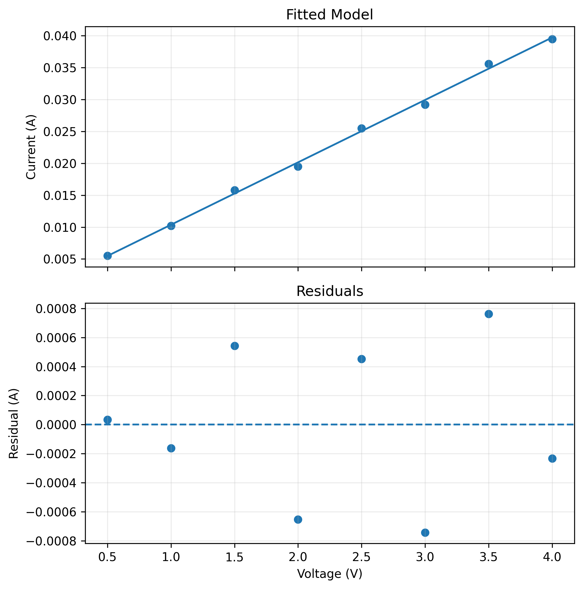
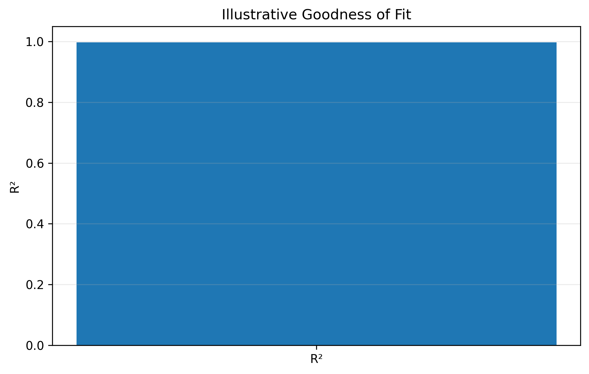
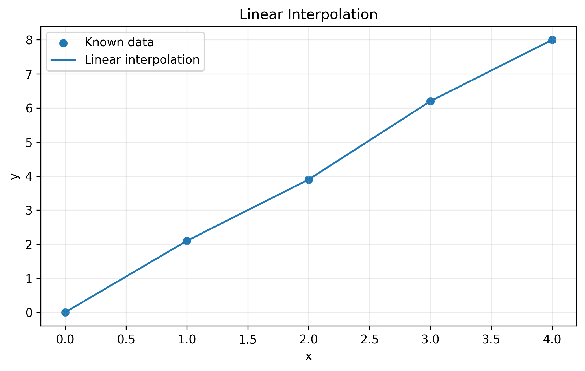
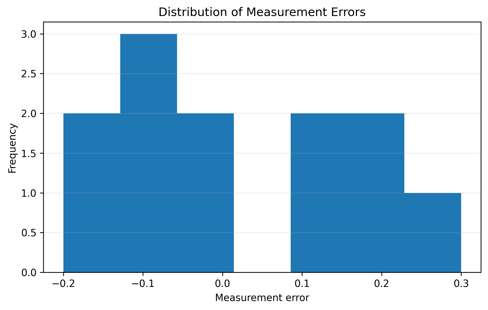
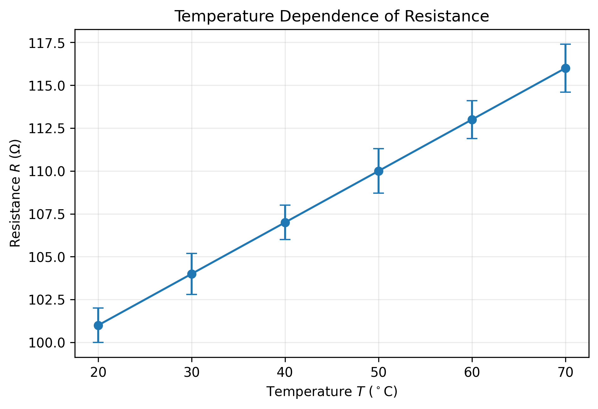

# Chapter 15 — Scientific Data Analysis and Reporting

## 15.1 Learning Objectives

After completing this chapter, you should be able to:

- summarize repeated scientific measurements;
- calculate mean and standard deviation;
- distinguish absolute error from percentage error;
- visualize measurement uncertainty;
- perform simple linear fitting;
- calculate and interpret residuals;
- understand the basic idea of goodness of fit;
- perform simple interpolation;
- visualize the distribution of measurement errors;
- prepare clear figures for scientific reports;
- interpret numerical results together with graphs;
- develop a reproducible workflow from raw data to scientific reporting.

---

15.2 From Data to a Scientific Conclusion

A scientific Python workflow does not end when a graph is produced.

A typical workflow is:

```text
Experimental observation
        ↓
Data organization
        ↓
Basic statistical summary
        ↓
Error / uncertainty analysis
        ↓
Numerical analysis
        ↓
Visualization
        ↓
Interpretation
        ↓
Scientific report
```

Each stage answers a different question.

A plot may reveal a pattern, but statistical and numerical analysis help quantify that pattern.

---

15.3 Repeated Measurements

Scientific measurements are rarely identical.

Suppose a quantity is measured six times:

```python
data = np.array([
    10.2,
    9.8,
    10.1,
    10.4,
    9.9,
    10.0
])
```

Calculate the mean:

```python
mean = np.mean(data)
```

The arithmetic mean is:

$$
\bar{x}
=
\frac{1}{n}
\sum_{i=1}^{n}x_i.
$$

For these observations:

$$
\bar{x}=10.0667.
$$

We can visualize the observations and their mean:

```python
measurement_no = np.arange(1, 7)

plt.scatter(measurement_no, data, label="Measurements")
plt.axhline(np.mean(data), linestyle="--", label="Mean")

plt.xlabel("Measurement number")
plt.ylabel("Measured value")
plt.title("Repeated Measurements and Mean")

plt.grid()
plt.legend()
plt.show()
```

**Output — Figure 15.1**



The mean provides a summary of the central tendency of the observations.

It does not describe how much the observations vary.

---

15.4 Standard Deviation

The sample standard deviation is:

$$
s=
\sqrt{
\frac{1}{n-1}
\sum_{i=1}^{n}(x_i-\bar{x})^2
}.
$$

In NumPy:

```python
std = np.std(data, ddof=1)
```

The argument:

```python
ddof=1
```

specifies the sample standard deviation.

The mean and standard deviation answer different questions:

```text
Mean
→ Where are the observations centered?

Standard deviation
→ How much do the observations vary?
```

---

15.5 Absolute Error

Suppose a reference or accepted value is:

$$
x_{\mathrm{ref}}=10.
$$

For a measured value:

$$
x_{\mathrm{measured}}=9.8,
$$

the absolute error is:

$$
E_{\mathrm{abs}}
=
|x_{\mathrm{measured}}-x_{\mathrm{ref}}|.
$$

Therefore:

$$
E_{\mathrm{abs}}
=
|9.8-10|
=
0.2.
$$

In Python:

```python
absolute_error = abs(measured - reference)
```

Absolute error has the same unit as the measured quantity.

---

15.6 Percentage Error

Percentage error is:

$$
E_{\%}
=
\frac{
|x_{\mathrm{measured}}-x_{\mathrm{ref}}|
}{
|x_{\mathrm{ref}}|
}
\times100.
$$

For example:

```python
reference = 10
measured = 9.8

percentage_error = (
    abs(measured - reference)
    / abs(reference)
) * 100
```

The percentage error allows errors to be compared on a relative scale.

---

15.7 Visualizing Percentage Error

Consider several measurements:

```python
true_value = 10.0

measured = np.array([
    9.6,
    9.8,
    10.1,
    10.3,
    10.5
])

percentage_error = (
    np.abs(measured - true_value)
    / true_value
) * 100
```

Plot:

```python
plt.plot(
    measured,
    percentage_error,
    marker="o"
)

plt.xlabel("Measured value")
plt.ylabel("Absolute percentage error (%)")
plt.title("Measurement Error")

plt.grid()
plt.show()
```

**Output — Figure 15.2**



The graph shows how the relative error changes as measurements move away from the reference value.

---

15.8 Error Does Not Always Mean Mistake

In experimental science, measurement error does not necessarily mean that someone made a mistake.

Sources can include:

- instrument limitations;
- environmental variation;
- sample variation;
- measurement procedure;
- rounding;
- random fluctuations.

It is therefore useful to distinguish:

```text
Measurement error
        ≠
Human mistake
```

Scientific analysis attempts to quantify and understand uncertainty.

---

15.9 Linear Relationships

Suppose an experiment suggests:

$$
y=a+bx.
$$

Here:

- \(a\) is the intercept;
- \(b\) is the slope.

For an I-V relationship:

$$
I=a+bV.
$$

If the resistor follows Ohm's law:

$$
I=\frac{1}{R}V,
$$

then:

$$
a\approx0
$$

and:

$$
b\approx\frac{1}{R}.
$$

A fitted slope can therefore have a physical interpretation.

---

15.10 Linear Fitting with NumPy

Consider:

```python
V = np.array([
    0.5, 1, 1.5, 2,
    2.5, 3, 3.5, 4
])

I = np.array([
    0.0055, 0.0102, 0.0158, 0.0195,
    0.0255, 0.0292, 0.0356, 0.0395
])
```

Fit a straight line:

```python
coef = np.polyfit(V, I, 1)
```

The value `1` specifies a first-degree polynomial.

The result contains:

```text
slope
intercept
```

Generate fitted values:

```python
V_fit = np.linspace(V.min(), V.max(), 100)
I_fit = np.polyval(coef, V_fit)
```

Plot:

```python
plt.scatter(V, I, label="Measured")
plt.plot(V_fit, I_fit, label="Linear fit")

plt.xlabel("Voltage (V)")
plt.ylabel("Current (A)")
plt.title("Experimental Data and Linear Fit")

plt.grid()
plt.legend()

plt.show()
```

**Output — Figure 15.3**



---

15.11 Interpreting the Slope

For:

$$
I=a+bV,
$$

the slope is:

$$
b=\frac{\Delta I}{\Delta V}.
$$

For an ideal resistor:

$$
b=\frac{1}{R}.
$$

Therefore:

$$
R=\frac{1}{b}.
$$

This illustrates an important principle:

> A fitted numerical parameter can have a physical meaning.

The interpretation must always follow the physical model being used.

---

15.12 Residuals

A residual measures the difference between an observed value and its fitted value.

For observation \(i\):

$$
e_i=y_i-\hat{y}_i.
$$

where:

- \(y_i\) is the observed value;
- \(\hat{y}_i\) is the fitted value.

In Python:

```python
residuals = I - np.polyval(coef, V)
```

Residuals can reveal systematic patterns that may not be obvious from the original plot.

---

15.13 Visualizing Residuals

A useful analysis places the fitted model and residuals together.

```python
fit_at_data = np.polyval(coef, V)
residuals = I - fit_at_data

fig, ax = plt.subplots(2, 1, figsize=(7, 7))

ax[0].scatter(V, I)
ax[0].plot(V, fit_at_data)
ax[0].set_ylabel("Current (A)")
ax[0].set_title("Fitted Model")
ax[0].grid()

ax[1].axhline(0, linestyle="--")
ax[1].scatter(V, residuals)
ax[1].set_xlabel("Voltage (V)")
ax[1].set_ylabel("Residual (A)")
ax[1].set_title("Residuals")
ax[1].grid()

plt.tight_layout()
plt.show()
```

**Output — Figure 15.4**



If residuals show a clear pattern, the chosen model may not adequately describe the data.

Residuals are therefore an important diagnostic.

---

15.14 Goodness of Fit

One common measure for a simple regression is:

$$
R^2
=
1-
\frac{
\sum_i(y_i-\hat{y}_i)^2
}{
\sum_i(y_i-\bar{y})^2
}.
$$

In a simple setting, \(R^2\) indicates how much of the observed variation is explained by the fitted model.

For the example:

```python
ss_res = np.sum((I - fit_at_data)**2)
ss_tot = np.sum((I - np.mean(I))**2)

r_squared = 1 - ss_res / ss_tot
```

A value closer to 1 indicates a stronger linear fit for this particular measure.

However:

> A high \(R^2\) does not prove that a model is scientifically correct.

Model validity requires scientific reasoning and additional diagnostics.

---

15.15 Visualizing Goodness of Fit

For illustration:

```python
plt.bar(
    ["R²"],
    [r_squared]
)

plt.ylim(0, 1.05)
plt.ylabel("R²")
plt.title("Illustrative Goodness of Fit")

plt.grid(axis="y")
plt.show()
```

**Output — Figure 15.5**



A single goodness-of-fit statistic should not replace inspection of the data and residuals.

---

15.16 Interpolation

Sometimes we know values at two or more points and want to estimate a value between them.

This is interpolation.

Suppose:

```python
x = np.array([0, 1, 2, 3, 4])
y = np.array([0, 2.1, 3.9, 6.2, 8.0])
```

We can use:

```python
x_new = np.linspace(0, 4, 200)
y_new = np.interp(x_new, x, y)
```

Plot:

```python
plt.scatter(x, y, label="Known data")
plt.plot(x_new, y_new, label="Linear interpolation")

plt.xlabel("x")
plt.ylabel("y")
plt.title("Linear Interpolation")

plt.grid()
plt.legend()

plt.show()
```

**Output — Figure 15.6**



Interpolation estimates values **within the range of observed data**.

This is different from extrapolation, which estimates beyond the observed range.

---

15.17 Interpolation versus Extrapolation

Suppose measurements are available for:

$$
0\leq x\leq4.
$$

Estimating \(y\) at:

$$
x=2.5
$$

is interpolation.

Estimating \(y\) at:

$$
x=8
$$

is extrapolation.

Extrapolation can be much more uncertain because the observed data do not constrain the behavior beyond the measured range.

---

15.18 Distribution of Measurement Errors

When several measurement errors are available, their distribution can be visualized.

For example:

```python
errors = np.array([
    -0.2, 0.1, -0.1, 0.3,
    -0.1, 0.0, 0.2, -0.2,
    0.1, 0.0, 0.2, -0.1
])

plt.hist(errors, bins=7)

plt.xlabel("Measurement error")
plt.ylabel("Frequency")
plt.title("Distribution of Measurement Errors")

plt.grid(axis="y")
plt.show()
```

**Output — Figure 15.7**



A histogram helps us inspect the distribution of observations or errors.

It does not automatically establish that the data follow a particular probability distribution.

---

15.19 From Analysis to Scientific Reporting

A scientific report should communicate:

```text
What was measured?
        ↓
How was it measured?
        ↓
What was calculated?
        ↓
What was observed?
        ↓
How uncertain is the result?
        ↓
What does the result mean?
```

Python can support every stage of the numerical analysis, but the scientific explanation remains essential.

---

15.20 Building a Report-Ready Figure

Consider a temperature-dependent resistance measurement.

```python
T = np.array([20, 30, 40, 50, 60, 70])

R = np.array([
    101, 104, 107, 110, 113, 116
])

uncertainty = np.array([
    1, 1.2, 1, 1.3, 1.1, 1.4
])

plt.errorbar(
    T,
    R,
    yerr=uncertainty,
    fmt="o-",
    capsize=4
)

plt.xlabel(r"Temperature $T$ ($^\circ$C)")
plt.ylabel(r"Resistance $R$ ($\Omega$)")
plt.title("Temperature Dependence of Resistance")

plt.grid()
plt.tight_layout()

plt.show()
```

**Output — Figure 15.8**



The figure contains:

- physical variables;
- mathematical symbols;
- units;
- uncertainty;
- readable dimensions;
- a concise title;
- a clear scientific relationship.

---

15.21 Figure Captions

A figure in a scientific report should normally have a caption.

A useful caption answers:

1. What is shown?
2. What variables are represented?
3. What does the reader need to notice?

For example:

> **Figure 15.8 — Temperature dependence of resistance.** Resistance is shown as a function of temperature, with error bars representing the stated measurement uncertainty.

The caption should add context rather than simply repeat the axis labels.

---

15.22 Reproducibility

A major advantage of Python is reproducibility.

Instead of manually drawing a graph:

```text
Data
 ↓
Python code
 ↓
Calculation
 ↓
Figure
```

The same code can be executed again when the data change.

For example:

```python
data = np.loadtxt("measurements.csv", delimiter=",")
```

can be followed by the same analysis and plotting workflow.

This reduces manual errors and makes scientific work easier to update.

---

15.23 A Reproducible Scientific Workflow

A simple project structure could be:

```text
scientific_project/
│
├── data/
│   └── measurements.csv
│
├── notebooks/
│   └── analysis.ipynb
│
├── figures/
│   └── iv_curve.png
│
└── report/
    └── report.md
```

The exact structure may vary.

The important idea is to keep:

- raw data;
- analysis code;
- generated figures;
- written conclusions

organized and traceable.

---

15.24 Scientific Interpretation

A numerical result is not the same as a scientific conclusion.

For example:

```text
Slope = 0.0098 A/V
```

is a numerical result.

If the model is:

$$
I=\frac{V}{R},
$$

we may interpret:

$$
R\approx\frac{1}{0.0098}
\approx102\,\Omega.
$$

The second statement connects the numerical result to a physical parameter.

A strong scientific analysis therefore moves from:

```text
Number
 ↓
Pattern
 ↓
Model
 ↓
Physical interpretation
```

---

15.25 Common Mistakes

### Mistake 1 — Reporting only the mean

A mean without variation may hide important information.

### Mistake 2 — Confusing error with mistake

Measurement uncertainty is part of experimental science.

### Mistake 3 — Overinterpreting R²

A high \(R^2\) does not guarantee a scientifically valid model.

### Mistake 4 — Ignoring residuals

Residual patterns may reveal model inadequacy.

### Mistake 5 — Extrapolating without justification

Predictions outside the measured range may be unreliable.

### Mistake 6 — Reporting figures without units

A number without a physical unit may be ambiguous.

### Mistake 7 — Treating a fitted curve as measured data

Clearly distinguish observations from models.

### Mistake 8 — Manually modifying scientific results

Keep the analysis reproducible through code.

---

15.26 Exercises

### Exercise 1 — Repeated Measurements

Create 10 repeated measurements of a quantity.

Calculate:

- mean;
- sample standard deviation;
- minimum;
- maximum.

Plot the observations and mean.

### Exercise 2 — Percentage Error

Assume a reference value of:

$$
5.00.
$$

Calculate the percentage error for five measured values.

Plot measured value against percentage error.

### Exercise 3 — Linear Fit

Create experimental I-V data.

Use `np.polyfit()` to obtain a linear model.

Calculate the resistance from the fitted slope.

### Exercise 4 — Residual Analysis

Calculate residuals from the fitted model.

Plot the residuals.

Determine whether a visible systematic pattern exists.

### Exercise 5 — Interpolation

Given five experimental observations, estimate three intermediate values using `np.interp()`.

### Exercise 6 — Error Distribution

Generate a set of measurement errors and create a histogram.

Describe the shape of the distribution.

### Exercise 7 — Scientific Figure

Create a report-ready figure containing:

- variables;
- units;
- uncertainty;
- title;
- legend where necessary;
- grid;
- appropriate figure size.

Save the result at 300 dpi.

---

15.27 Think and Apply

A student obtains:

$$
R^2=0.99.
$$

They conclude:

> "The model is correct."

Is this conclusion justified?

Consider:

- What physical model was fitted?
- Are the residuals random?
- Are the measurements reliable?
- Is the fitted range appropriate?
- Are there systematic errors?
- Does the model make physical sense?

A statistical measure supports scientific reasoning; it does not replace it.

---

15.28 Chapter Summary

In this chapter, we learned that:

1. Repeated measurements can be summarized using mean and standard deviation.
2. Absolute error and percentage error quantify deviation from a reference value.
3. Error does not necessarily mean human mistake.
4. Linear fitting can quantify relationships between variables.
5. A fitted slope may have physical meaning.
6. Residuals help diagnose model adequacy.
7. \(R^2\) is one measure of goodness of fit but should not be interpreted alone.
8. Interpolation estimates values within an observed range.
9. Extrapolation extends beyond the observed range and requires greater caution.
10. Histograms help inspect distributions of measurements or errors.
11. Scientific figures should communicate variables, units, uncertainty, and relationships clearly.
12. Python supports reproducible scientific analysis.
13. Scientific conclusions require interpretation, not just numerical output.

---

15.29 Key Takeaway

> **Scientific data analysis is more than calculating numbers or drawing graphs. It connects measurements, uncertainty, mathematical models, visualization, and physical interpretation into a reproducible scientific argument.**
